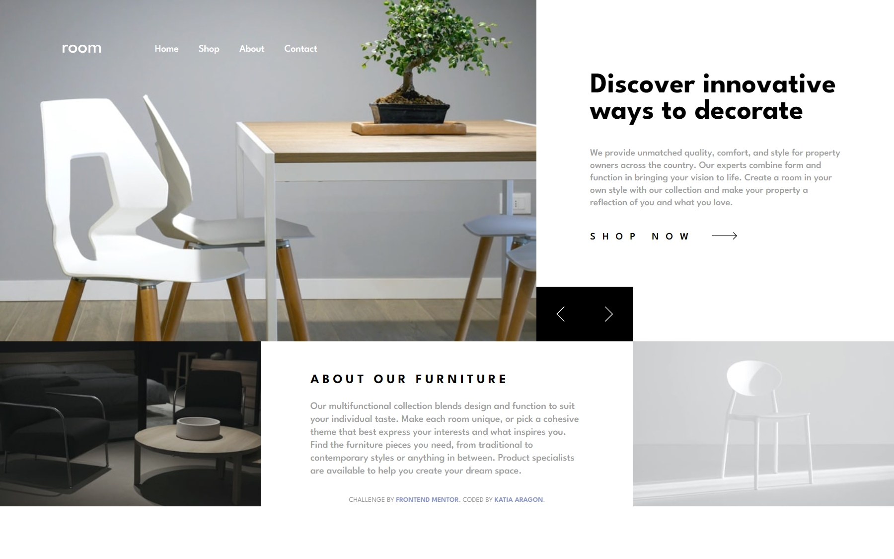
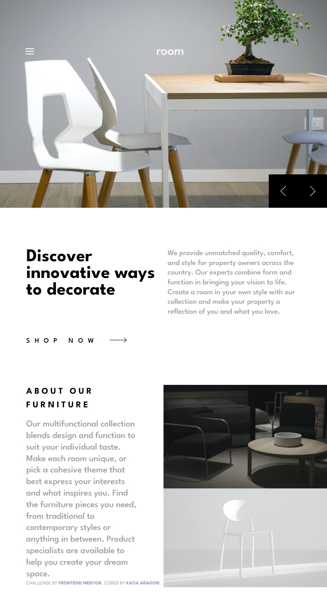
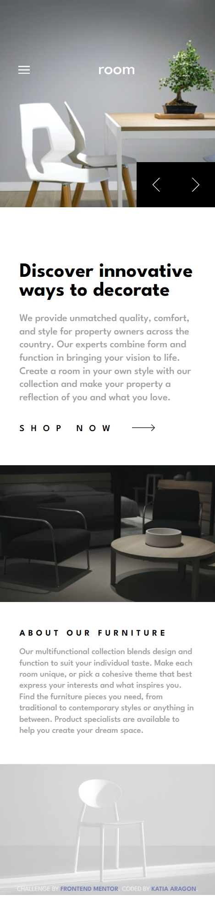
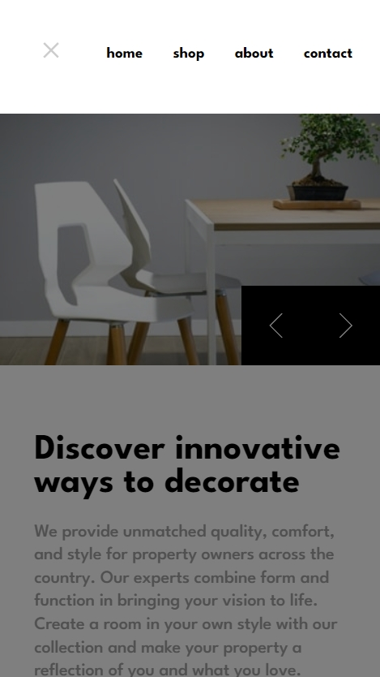

# Frontend Mentor - Room homepage solution

This is a solution to the [Room homepage challenge on Frontend Mentor](https://www.frontendmentor.io/challenges/room-homepage-BtdBY_ENq). Frontend Mentor challenges help you improve your coding skills by building realistic projects.

## Table of contents

- [Overview](#overview)
  - [Screenshot](#screenshot)
- [My process](#my-process)
  - [Built with](#built-with)

## Overview

This web was made with the pourpouse of practicing: scss, transitions, animations, object positioning and overall Js.

Users should be able to:

- View the optimal layout for the site depending on their device's screen size
- See hover states for all interactive elements on the page
- Navigate the slider using either their mouse/trackpad or keyboard

### Screenshot

## My process

I've noticed I can solve some things much faster than I did in previous projects. Positioning the buttons and the mobile menu was still a challenge, but now I know how to fix those kinds of problems. I'm happy with the result and my progress.

### Built with

- HTML
- CSS
- SCSS
- JAVA SCRIPT
